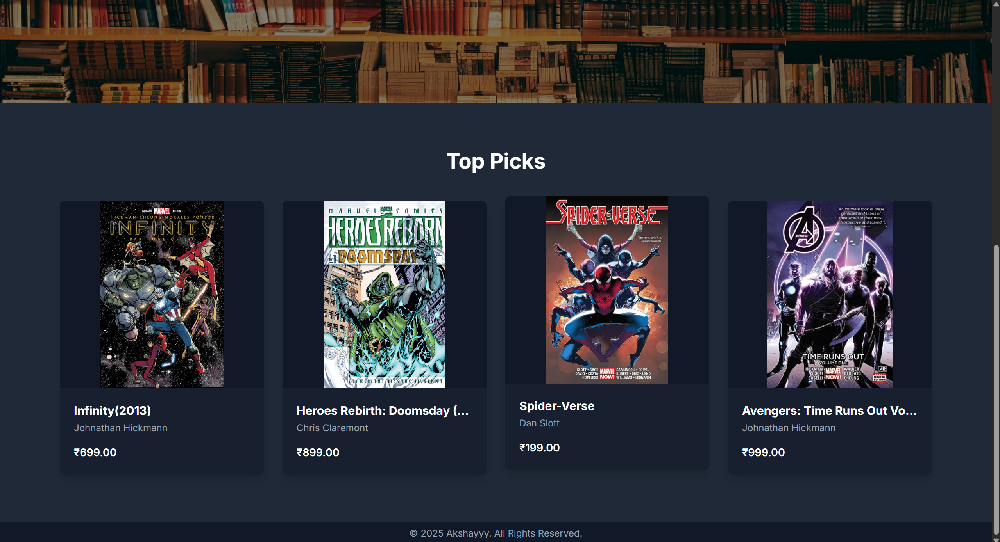
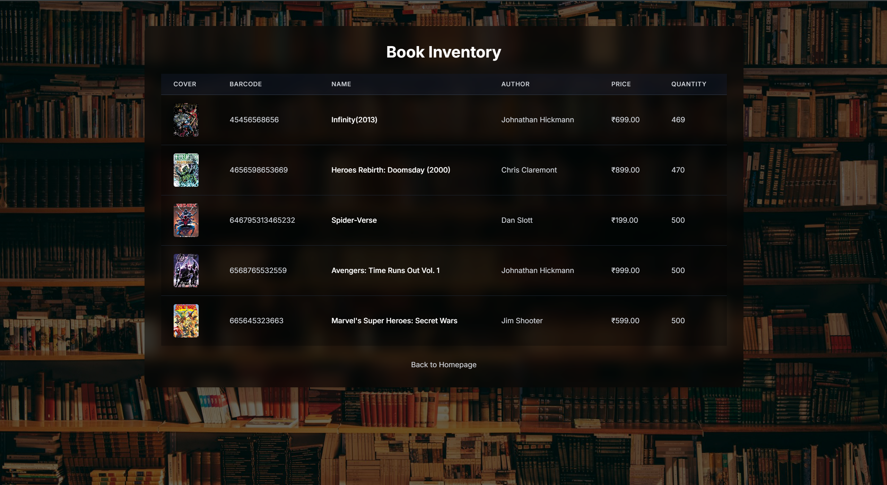
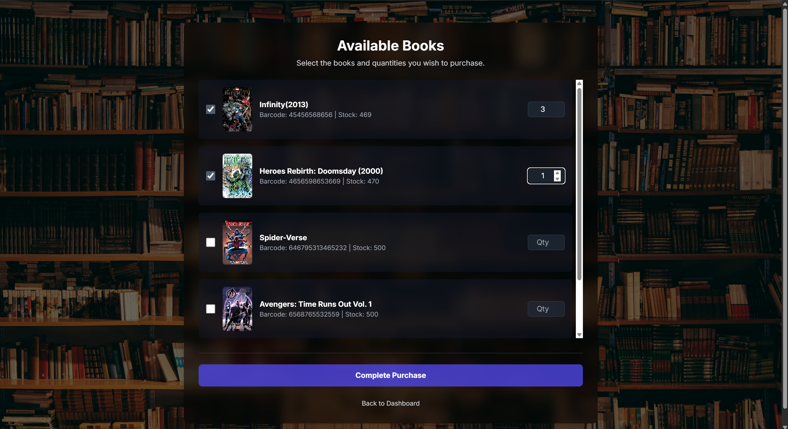

# Online Bookstore System

A full-stack e-commerce style application that simulates a production-like online bookstore with transactional inventory management, role-based access control, and persistent relational data storage.

The system is implemented using a **Node.js (Express) backend**, **MySQL database**, and a **dynamic JavaScript frontend**, demonstrating practical backend engineering concepts such as request lifecycle handling, database consistency, API design, and operational admin workflows.

This project emphasizes **correct state transitions, inventory integrity, and separation of platform responsibilities between customers and administrators.**

---

## 📸 Application Preview

### Home Preview




Displays the Home Interface.

---

### User Catalog View



Displays available books with metadata, pricing, and cover images.
Users can browse inventory and initiate purchase flows.

---

### Purchase Flow



Users select quantity and execute purchase requests.
Inventory updates are reflected immediately after successful transactions.

---

### Admin Dashboard


Administrators can add new books, remove inventory using barcode identifiers, and monitor registered users.

---

### Add Book (Image Upload)


Supports multipart file upload for book cover ingestion with backend validation.

---

## Overview

Real-world online retail platforms must handle:

* Concurrent catalog browsing and purchase operations
* Strong inventory consistency guarantees
* Administrative lifecycle control over products
* Media asset ingestion and serving
* Persistent relational data modelling

This project models an **online bookstore platform** where users can explore and purchase books while administrators maintain operational visibility and inventory correctness.

---

## Key Features

### Customer Purchase Flow

* Account registration and authentication
* Full catalog browsing with metadata and cover images
* Quantity-aware purchase requests
* Real-time inventory deduction after successful transactions
* Persistent state reflection across sessions

### Administrative Operations

* Dedicated admin authentication boundary
* Book inventory lifecycle management
* Book creation with image upload support
* Barcode-driven deletion workflows
* Visibility into registered platform users

### Inventory Consistency Guarantees

* Pre-transaction stock validation
* Atomic update queries to prevent overselling
* Deterministic state transitions for purchase execution

### Media Asset Handling

* Local filesystem storage for uploaded cover images
* Backend validation for upload payloads
* Dynamic rendering through API-driven UI

### Real-Time Data Synchronization

* Frontend state driven entirely by backend responses
* Immediate visibility of admin and user operations
* Database-backed single source of truth

---

## System Architecture

```bash
Browser Client (HTML / CSS / JavaScript)
        |
        | HTTP REST Requests
        v
Node.js Backend (Express Routing Layer)
        |
        | SQL Queries / Transactions
        v
MySQL Relational Database
```

---

## Core Engineering Concepts

* REST API contract design
* Role-based access segregation
* Relational schema normalization
* Transaction-safe inventory mutation
* Backend input validation and error handling
* Stateful request handling
* Full-stack integration patterns

---

## Data Model

### Books Table

Maintains catalog and stock state.

* `barcode` (Primary Key)
* `title`
* `author`
* `price`
* `quantity`
* `cover_image_path`

### Users Table

Maintains authentication and authorization attributes.

* `user_id`
* `username`
* `password_hash`
* `role`

---

## API Surface

### Register User

```bash
curl -X POST http://localhost:5000/register \
  -H "Content-Type: application/json" \
  -d '{"username":"akshay","password":"securepass"}'
```

---

### Login User

```bash
curl -X POST http://localhost:5000/login \
  -H "Content-Type: application/json" \
  -d '{"username":"akshay","password":"securepass"}'
```

---

### Fetch Catalog

```bash
curl http://localhost:5000/books
```

---

### Purchase Book

```bash
curl -X POST http://localhost:5000/purchase \
  -H "Content-Type: application/json" \
  -d '{"bookId":101,"quantity":2}'
```

---

### Admin Login

```bash
curl -X POST http://localhost:5000/admin/login \
  -H "Content-Type: application/json" \
  -d '{"username":"admin","password":"adminpass"}'
```

---

### Add Book (Admin)

```bash
curl -X POST http://localhost:5000/admin/add-book \
  -F "title=Distributed Systems" \
  -F "author=Tanenbaum" \
  -F "price=599" \
  -F "quantity=10" \
  -F "cover=@cover.jpg"
```

---

### Remove Book (Admin)

```bash
curl -X DELETE http://localhost:5000/admin/remove-book \
  -H "Content-Type: application/json" \
  -d '{"barcode":101}'
```

---

### Fetch Registered Users (Admin)

```bash
curl http://localhost:5000/admin/users
```

---

## Complexity Characteristics

* Indexed book lookup: `O(log N)`
* Inventory mutation query: `O(1)`
* Full catalog retrieval: `O(N)`
* Authentication lookup: `O(log N)`

---

## Tech Stack

* Node.js
* Express.js
* MySQL
* JavaScript (ES6+)
* HTML5
* CSS3

---

## Design Tradeoffs

* In-memory session simplification instead of distributed session store
* Local media storage instead of object storage (e.g., S3)
* No caching layer (Redis / CDN)
* No payment gateway integration
* Single-instance deployment model
* No optimistic locking or queue-based concurrency control

These constraints intentionally prioritize **core backend correctness and relational data integrity over infrastructure complexity.**

---

## Local Setup

### Clone Repository

```bash
git clone <repository-url>
cd online-bookstore
```

---

### Install Dependencies

```bash
npm install
```

---

### Configure Database

Create database:

```bash
mysql -u root -p -e "CREATE DATABASE book_store;"
```

Initialize schema:

```bash
node setup_database.js
```

---

### Start Application Server

```bash
node index.js
```

Application runs at:

```bash
http://localhost:5000
```

---

## Motivation

This system was built to demonstrate:

* End-to-end backend ownership of state transitions
* Transactional integrity in inventory-driven systems
* Role-aware platform workflows
* Practical full-stack request orchestration

It reflects engineering patterns relevant to **e-commerce backends, SaaS platforms, and marketplace infrastructure systems.**

---

## Author

**Akshay Banajgole**
Computer Science & Engineering
Focus Areas: Backend Engineering · System Design · Distributed Systems
